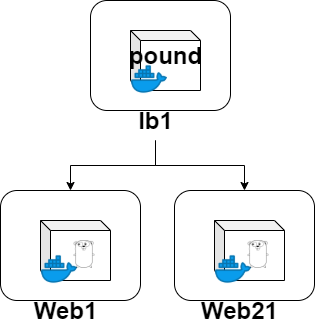

= Poundについて

== Vagrant起動からプロビジョニングまで

----
$ make up
$ make provision-each-vm
----

== 簡易Webサーバを起動

----
$ make up-web

確認
$ curl http://192.168.5.11:8080/
Hello, Golang by web1

$ curl http://192.168.5.12:8080/
Hello, Golang by web2
----

== 片付け(VMは落とさない)

----
$ make clean
----

== VMを落とすなら(停止or削除)

----
$ vagrant halt
or
$ vagrant destroy
----
